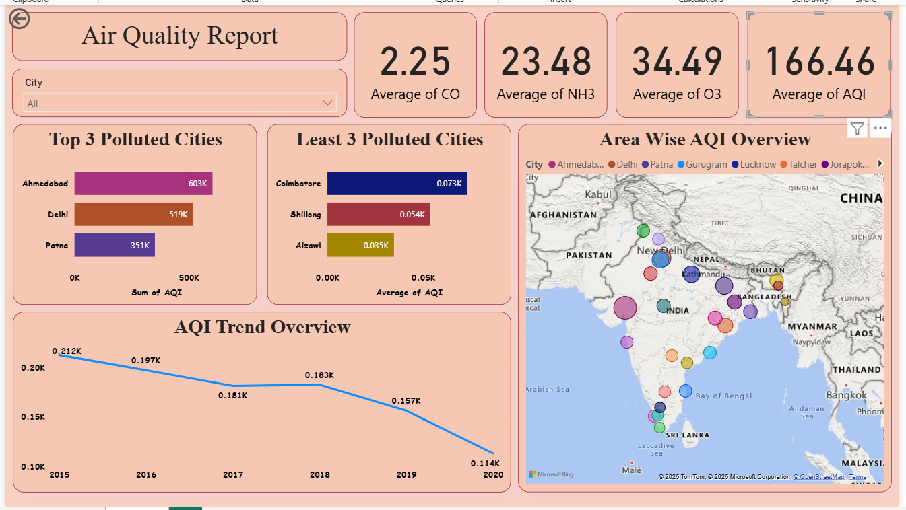

## Air Quality Analysis Dashboard 🌍

This Power BI dashboard analyzes air quality levels across multiple cities, focusing on AQI and key pollutants.

### Key Insights
- Average levels of CO, NH3, O3, and AQI
- Top 3 most polluted cities
- Least polluted cities based on AQI
- Area-wise AQI distribution using map visualization
- AQI trends over multiple years

### Tools & Technologies
- Power BI
- Environmental Data Analysis
- Data Visualization

This dashboard helps identify pollution patterns and supports data-driven environmental awareness.

