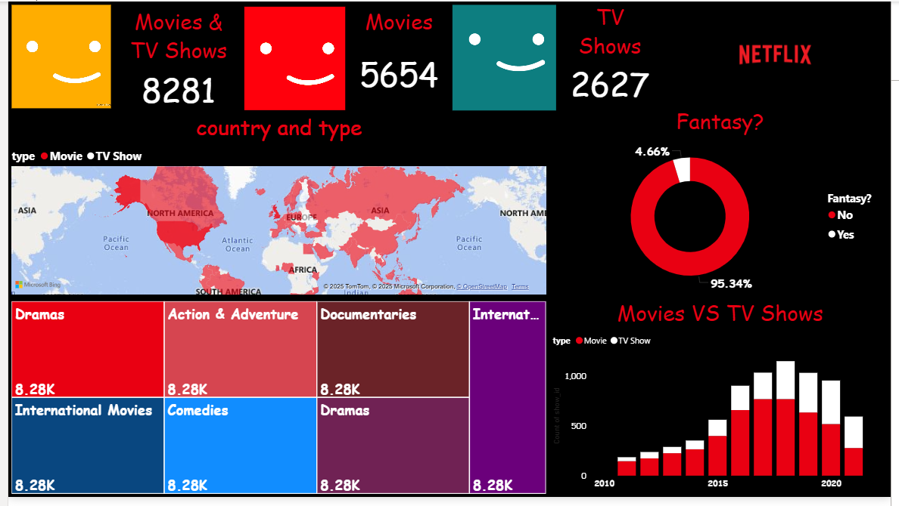

## Netflix Content Analysis Dashboard 🎬

This Power BI dashboard provides an in-depth analysis of Netflix’s content library, covering both movies and TV shows across different countries, genres, and release years.

### Key Insights
- Total count of Movies and TV Shows available on Netflix
- Geographic distribution of content by country
- Genre-wise content breakdown (Drama, Action & Adventure, Documentaries, etc.)
- Comparison between Movies and TV Shows over time
- Analysis of Fantasy vs Non-Fantasy content

### Tools & Technologies
- Power BI
- Data Visualization
- Data Cleaning & Modeling

This dashboard helps understand Netflix’s global content strategy and viewing trends.

