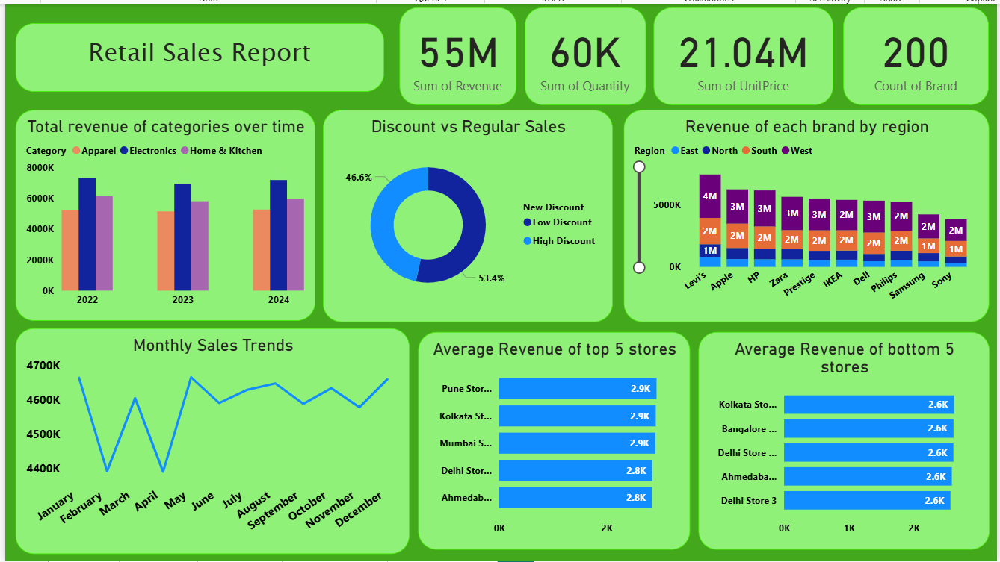
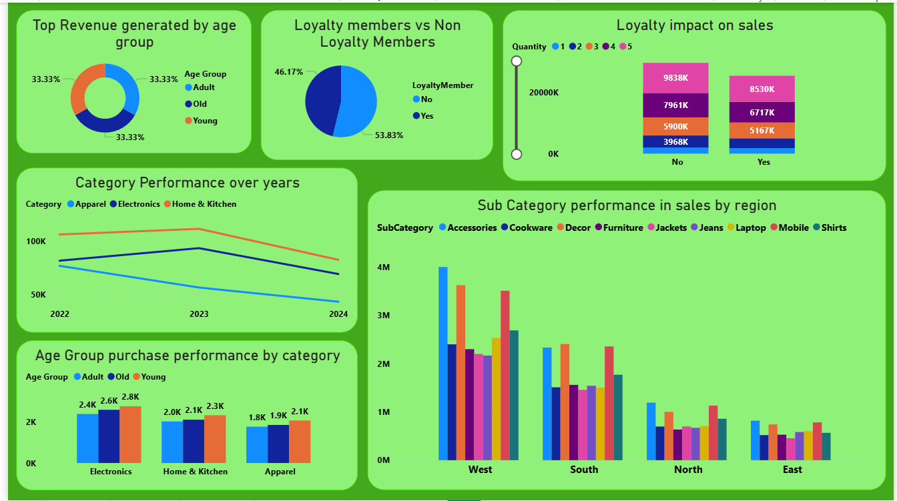
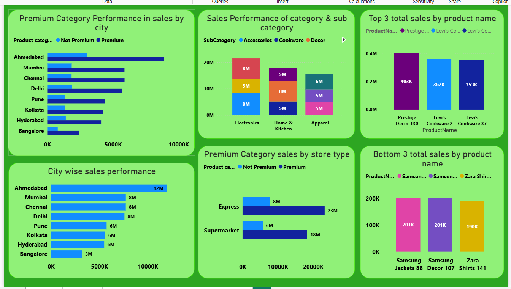
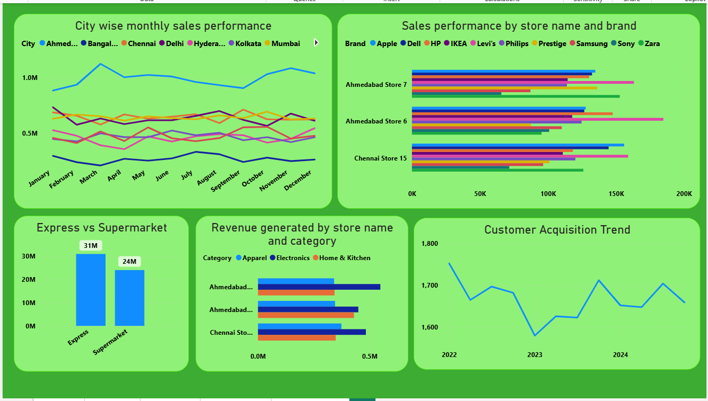
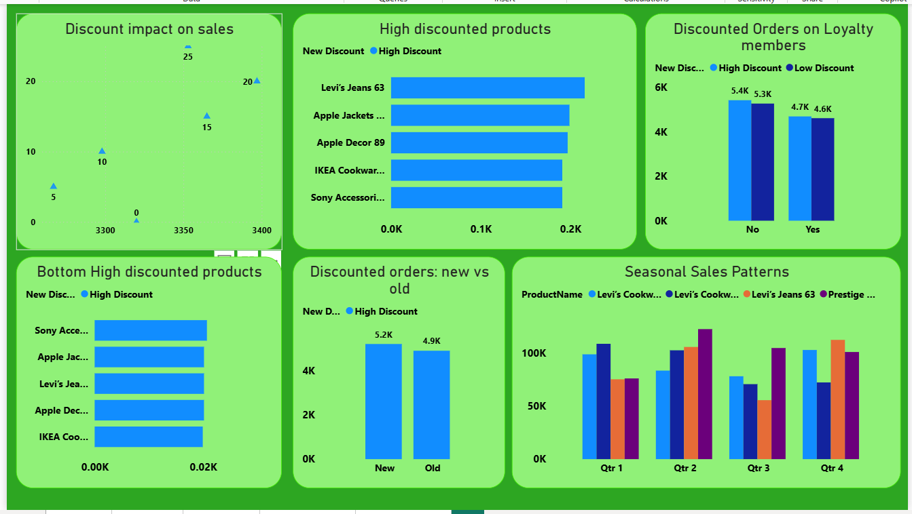

## Superstore Sales Performance Dashboard 🛒

This Power BI dashboard provides a comprehensive analysis of retail sales performance across categories, regions, and customer segments.

### Key Insights
- Total revenue, quantity sold, unit price, and brand count
- Category-wise revenue trends over time
- Discount vs regular sales comparison
- Regional revenue distribution by brand
- Monthly sales trends
- Top 5 and bottom 5 store performance
- Impact of customer loyalty on sales
- Revenue analysis by age group and sub-category

### Tools & Technologies
- Power BI
- Sales & Retail Analytics
- Data Visualization

This dashboard helps stakeholders understand sales behavior, customer segments, and regional performance.

